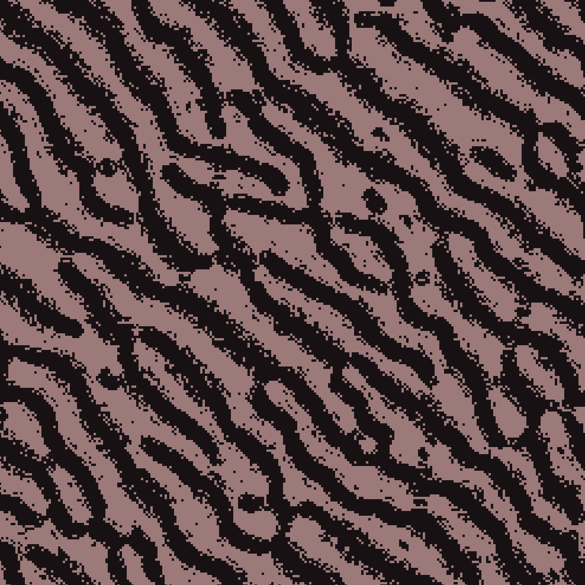
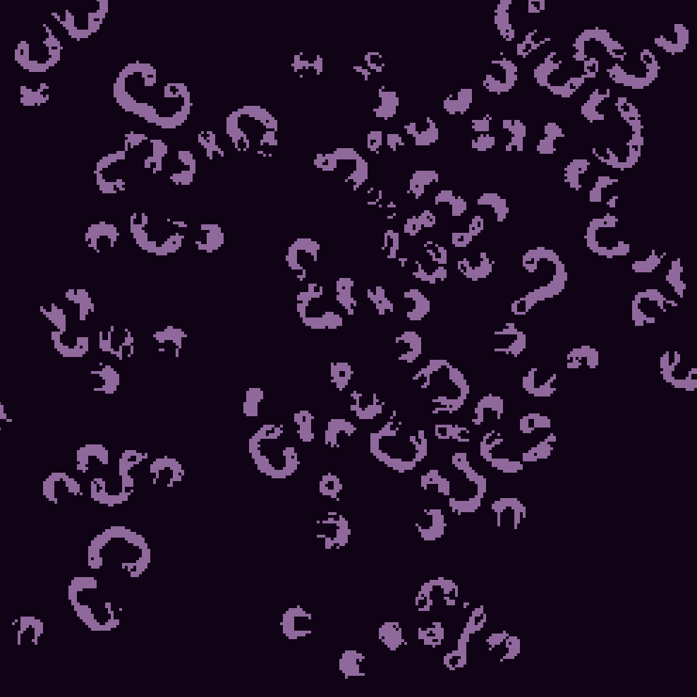
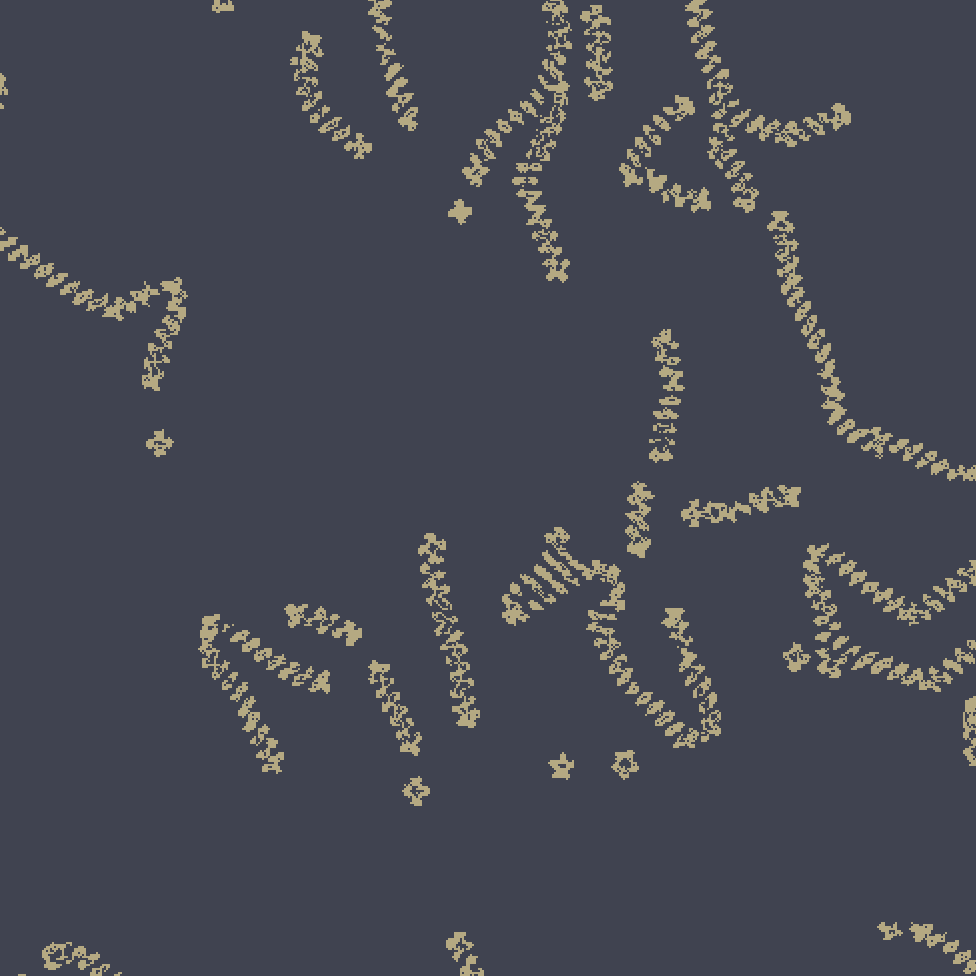

# God Machine

by Acerola

**God Machine** is a customizable two state multi-neighborhood cellular automaton

## How To Play

* Download this repo as a zip
* Extract the zip
* Open the Godot project manager
* Click on **Import**
* Navigate to where you extracted the zip file
* Run the godot project
* Press the play button in the top right once the editor opens

## Examples

