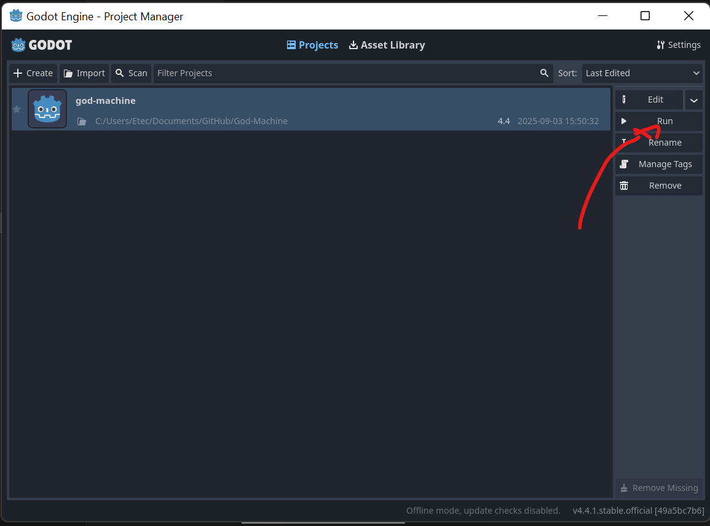

# God Machine

by Acerola

**God Machine** is a customizable two state multi-neighborhood cellular automaton

## How To Play

* Clone this repo with ```git clone --recursive <url>```
* Open the Godot project manager
* Click on **Import**
* Navigate to where you cloned the repo
* Select the godot project
* Press the **Run** button **inside the project manager** or the play button inside the editor


## System Requirements

* Windows
* 16:9 Resolution (ultra widescreen works)
* GPU released in the past decade

**DO NOT PLAY IF PHOTOSENSITIVE** it is very easy to produce strobing patterns

## Examples


